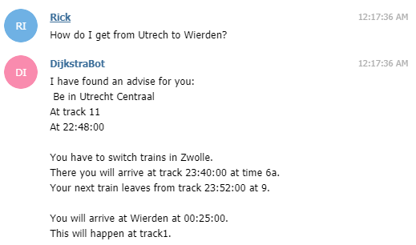
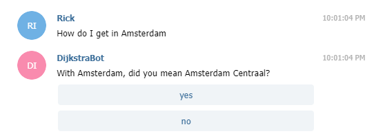
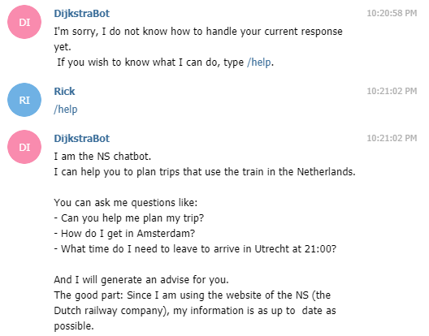

# NS chatbot
At this page you can find the code to work with the [NS chatbot](http://t.me/Im_on_a_bot).
This bot can help you with planning your trip. 

Instead of just following a rule based system, the bot will try to actively 
guess what was meant with a term when it encounters it and will try to fit it
to terms that it does understand. For example if you want to go to Amsterdam
Centraal, but you type Amstredam instead, the bot will ask whether you really
meant Amsterdam Centraal.

Below you can find some examples of the bot's behaviour.

The output from a complete trip contains:
- The station, track and time of departure
- Any possible switching of trains with info of what station this happens with
time and track of arrival and departure at that station.
- The station, track and time of arrival.
 

## Resources used
### NLTK toolkit
I used the NLTK toolkit to process words in such a way that most of there forms
are similar to each other. This is done with a process called stemming: you
try to find the stem of a word. This can help to find words meaning different 
things. For example: go and going both have the same stem go. To make the bot
understand that 'I am going to Amsterdam contains the same information as 'I 
would like to go to Amsterdam', it must pick up that Amsterdam (Centraal) is
the desired station of arrival.
Given a start and end station, the bot will the display the time of departure, 
the track number, the time of arrival, and it's track number, as well as other
times of arrival and departure at stations where you have to switch trains.
 
### NS API
The NS (Nederlandse Spoorwegen, the Dutch Railways) have released an API with 
which the bot can communicate to plan the trip for the user of the bot. Given
a start and end station and optional other variables as time and whether you
want previous routes, the API gives back a lot of information, from which we 
can let the bot build an advice.

### NS Stations list
The greatest tool for this application that the NS has released is a list of 
stations and their synonyms. Based on these synonyms, I can let the bot infer
the meaning of the user.

## Examples
Below you can find some examples of how the bot behaves.

##### Planning a trip


##### Synonym guessing


##### Unknown behaviour


## How to run 
In order to run this you will need to add config.py to the wg4-chatbot map.
config.py should contain the following code:

```
TOKEN = "<Insert bot token here>"
NS_WW = "<Insert NS password here">
NS_UN = "<Insert NS username here>"
```

A token can be created by contacting the [Botfather](http:t.me/botfather) at 
Telegram and asking for a new bot with `/newbot`

Access to the NS API can be found
 [here](https://www.ns.nl/ews-aanvraagformulier/?0)

## To do:
- Add a warning function
- Add a function where you can change the time of the planned trip.
- Include more NLP processing (eg. spellchecking, more synonym finding)
- Add more functionality
- Add better documentation
- Have more test-runs to see what still is going wrong
- Have fun with bot (and maybe put it on a server?)

